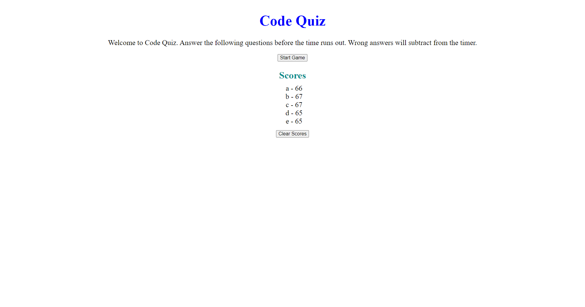

# codeQuiz

This code is for a timed code quiz. The first question and timer start on initial button click. New questions are rendered when the previous questions are answered. The score is based on the remaining time. Time is deducted for wrong answers. The users score is stored in local storage and posted to the html when the game is complete. 

Screenshot of finished work can be seen below:

The website is deployed [here](https://bhodge166.github.io/codeQuiz/)
